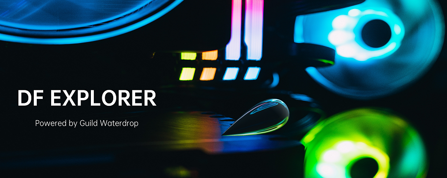

<div align="center">
	
	<br />
	<br />
</div>

<p align="center">
	<b>A Dark Forest Cuda Explorer</b>
</p>

<p align="center">
  Contributor: <a href="https://twitter.com/YUNYANDENG">@yunyandeng</a>
</p>
<p align="center">
❤ <a href="https://twitter.com/darkforest_eth">@darkforest_eth</a>❤
<p align="center">
	 <a href="https://buidl.mirror.xyz/0I9oYGGKOxDrb2m8OjubyxjU4wYbs9Zp49c0IO2OwUc">Guild Waterdrop</a>
	🦾<a href="https://twitter.com/marrowdao">MarrowDAO</a>


## How to use

df-explorer CGBN requires CUDA toolkit https://developer.nvidia.com/cuda-toolkit

+ clone with submodules
```bash
git clone --recurse-submodules https://github.com/guild-w/df-explorer.git
```  

+ install GMP
```bash
sudo apt install libgmp-dev
```
+ build the server component `workflow`
```bash
cd df-explorer/thirdparty/workflow/ && make
```

+ and back to project root build the df-explorer
```bash
cd ../../
mkdir build && cd build
cmake .. -DCMAKE_BUILD_TYPE=Release
make
```
+ start server and use `http://localhost:8880/explore` to connect to your miner with the plugin "Remote Explore"
```bash
./df-explorer
```

**It is highly recommended to increase the chunk size in "Remote Explore"** 
  
  ## About Guild Waterdrop
Guild W is the first on-chain e-sports team, incubated by MarrowDAO. The main members are Solidity developers, node operators, blockchain game players and investment analysts. All of them are loyal players of the Dark Forest.
  
  <div align="center">
	
	<br />
	<br />
</div>
 
 
Recently, MarrowDAO has received funding from Yuanyuzhou Ventures, Evernew Capital, DAppChaser and EM3DAO, and ecological support from ChainNews, RhizomeDAO and MaoDAO. We will uphold the aim of peaceful development and help real blockchain games to grow and prosper.
  


